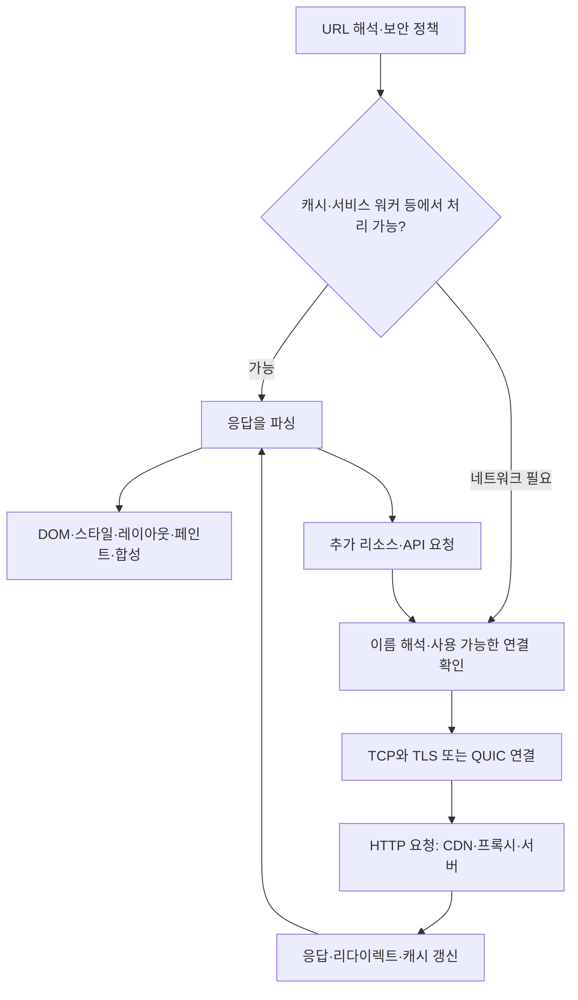

# 2-1. 주소창 입력에서 화면 표시까지

[목차](../README.md) · [정답·해설](01-navigation-answers.md)

예상 50분. 목표: 이름 해석·연결·보안·HTTP·렌더링을 구분하고, 느린 페이지의 병목 후보를 증거로 좁힙니다. 실제 네이버 내부 구현이나 특정 시점의 접속 결과를 알고 있다고 가정하지 않습니다.

## 1. 먼저 범위를 정하기

주소창에 `naver.com`을 입력하면 브라우저가 URL로 해석할지, 어떤 scheme을 사용할지, 기존 기록·보안 정책을 적용할지가 먼저 결정됩니다. 설명을 명확히 하기 위해 **`https://www.example.com/`으로 이동하는 일반적인 웹 탐색**을 사용합니다. `example.com`은 설명용 도메인입니다.

한 번의 탐색이 반드시 하나의 요청은 아닙니다. 첫 문서가 redirect를 돌려줄 수 있고, HTML 안의 CSS·JavaScript·이미지·폰트, 이후 API 호출도 추가 요청을 만듭니다. 일부는 다른 호스트로 갑니다.

## 2. 전체 경로

이는 **논리적 지도**입니다. 실제 브라우저는 DNS prefetch, preconnect, 병렬 요청, 스트리밍 파싱 등을 사용해 작업을 겹칠 수 있습니다. 서비스 워커도 요청을 가로채 로컬 응답 또는 네트워크 응답을 선택할 수 있습니다. 모든 구현의 정확한 함수 호출 순서를 나타내지는 않습니다.

| 단계 | 하는 일 | 하지 않는 일 |
| --- | --- | --- |
| DNS | 이름에 해당하는 레코드 조회, 접속 주소 후보 제공 | URL 경로별 앱 함수 실행 |
| TCP/QUIC | 상대와 데이터를 교환할 전송 경로·상태 관리 | 사용자의 서비스 권한 판단 |
| TLS | 통신 기밀성·무결성·상대 인증 기반 제공 | 사이트 내용의 진실성 보증 |
| HTTP | 메서드·대상·헤더·내용의 의미에 따라 요청·응답 | 화면 배치 계산 |
| 서버 처리 | 권한·업무 규칙·DB·외부 서비스 등 처리 | 브라우저의 모든 렌더링 비용 통제 |
| 렌더링 | 콘텐츠를 화면과 상호작용으로 변환 | 다운로드가 완료됐다는 이유만으로 즉시 종료 |

TCP와 TLS를 순서대로 설명하는 경로는 주로 HTTPS의 HTTP/1.1·HTTP/2에 해당합니다. HTTP/3는 UDP 위의 QUIC를 쓰고 TLS 1.3을 통합합니다. ‘모든 웹 요청은 TCP 연결로 시작한다’고 외우지 않습니다.

## 3. 캐시와 재사용이 경로를 바꾼다

| 재사용 대상 | 절약하는 것 | 감수할 비용·제약 |
| --- | --- | --- |
| DNS 캐시 | 이름 조회 비용 | 주소 변경을 즉시 반영하지 못할 수 있음 |
| 기존 연결 | 연결·보안 협상 비용 | 연결 자원·유휴 종료·오래된 연결 처리 |
| HTTP 응답 캐시 | 원본 요청·내용 전송 일부 또는 전부 | 신선도·권한·변형별 키 설계 |
| CDN의 가까운 복제본 | 원거리 왕복·원본 부하 | 배포·무효화·캐시 정책 관리 |

재방문이 빨라졌다고 DNS 캐시 덕분이라고 단정할 수 없습니다. 연결 재사용, 응답 캐시, 서비스 워커 등 여러 요인이 있습니다. 브라우저 개발자 도구의 ‘캐시 비활성화’가 DNS 캐시와 모든 기존 연결까지 없애는 것은 아닙니다.

## 4. 다운로드 완료와 사용 가능은 다르다

HTML은 DOM이라는 문서 구조로 파싱됩니다. CSS 규칙과 요소를 바탕으로 스타일을 계산하고, 레이아웃에서 위치·크기를 정한 뒤 페인트와 합성으로 화면을 만듭니다. JavaScript는 DOM을 바꾸거나 추가 요청을 만들고, 긴 실행으로 메인 스레드를 점유할 수도 있습니다.

브라우저 전체가 단일 스레드인 것은 아닙니다. 렌더러의 주요 UI·JavaScript 작업이 공유하는 메인 스레드와 별도의 네트워크·합성·워커 등이 있습니다. 일부 스크립트는 HTML 파싱을 막고 `defer`·`async`의 의미도 다릅니다. ‘파일 다운로드가 끝나면 모든 처리가 끝난다’고 보면 병목을 놓칩니다.

**설계 판단:** HTML에 필요한 내용을 먼저 담으면 첫 표시가 빨라질 수 있지만 서버 작업·응답 크기가 늘 수 있습니다. 클라이언트에서 조립하면 화면 전환이 유연하지만 스크립트·API 의존성과 기기 CPU 비용을 감수합니다. SSR/CSR은 하나의 절대 정답보다 초기 표시, 상호작용, 캐시, 개인화 요구를 비교할 주제입니다.

## 5. 관찰 과제: 워터폴 읽기

다음은 **독자가 브라우저에서 수행할 과제이며 이 환경에서는 실행하지 않았습니다.** 운영 사이트에 부하를 주는 반복 요청은 필요하지 않습니다. 본인 테스트 페이지나 공개 페이지의 보통 탐색 한두 번으로 충분합니다.

1. 개발자 도구의 Network 탭을 열고 탐색합니다. 브라우저 버전·캐시 설정을 기록합니다.
2. 문서 요청의 URL, 상태 코드, protocol, remote address, timing을 찾습니다. 표시 이름은 브라우저마다 다릅니다.
3. DNS, 연결·TLS, 첫 응답 대기, 다운로드에 해당하는 구간이 보이는지 확인합니다. 값이 없거나 0이면 단계가 없다는 결론 대신 재사용·계측 제한을 고려합니다.
4. 리다이렉트와 추가 리소스를 구분하고, 다른 호스트가 등장하는지 봅니다.
5. 재방문을 한 번 비교하되 캐시·재사용 정보를 함께 기록합니다.
6. 다운로드는 빨라도 클릭이 늦다면 Performance 탭에서 긴 메인 스레드 작업을 확인합니다.

HAR 파일 등 전체 기록에는 쿠키·토큰·개인정보가 포함될 수 있습니다. 공유가 필요한 학습에서는 해당 정보 없이 시간·상태·구조만 기록하세요.

**해석:** 첫 바이트까지 느림은 서버 계산뿐 아니라 네트워크 왕복·큐 대기·캐시 미스 등의 영향일 수 있습니다. 다운로드가 느리면 응답 크기·대역폭·혼잡을, 이후 반응이 느리면 렌더링·스크립트 실행을 조사합니다. 브라우저 timing 하나로 서버의 DB 병목을 확정하지 않습니다.

## 6. 퀴즈

Q1·Q2 각 1점, Q3·Q4 각 2점, Q5 4점. 권장 통과 8점.

### Q1
주소창 탐색 한 번에 HTTP 요청 하나만 발생하나요? 반례를 하나 적으세요.

### Q2
HTTP/3도 반드시 TCP 핸드셰이크를 먼저 수행하나요?

### Q3
재방문에서 DNS·TLS 시간이 표시되지 않습니다. 가능한 설명 두 가지를 적으세요.

### Q4
문서 다운로드는 100ms에 끝났지만 2초간 클릭이 반응하지 않습니다. 서버 증설 전 확인할 항목 두 가지와 이유를 쓰세요.

### Q5
해외 사용자의 첫 방문만 느리고 재방문은 빠릅니다. 원인 후보 세 개와 구분할 관찰 방법, 섣불리 단정하면 안 되는 점을 적으세요.

## 출처와 비판적으로 읽기

2026-10-01 확인.

- [MDN, How browsers work](https://github.com/mdn/content/blob/main/files/en-us/web/performance/guides/how_browsers_work/index.md): navigation·파싱·렌더링의 개요. 확인한 버전에는 TLS 왕복 횟수 등 지나치게 고정적인 설명이 있어 이 자료에서는 그대로 사용하지 않았습니다. 브라우저·전송 버전·재사용 조건을 구분합니다.
- [RFC 9110 §3](https://www.rfc-editor.org/rfc/rfc9110.html#section-3): HTTP 구성과 의미.
- [RFC 8446 §2](https://www.rfc-editor.org/rfc/rfc8446.html#section-2): TLS 1.3의 핸드셰이크 개요.
- [RFC 9114 §1~2](https://www.rfc-editor.org/rfc/rfc9114.html#section-1): HTTP/3와 QUIC.
