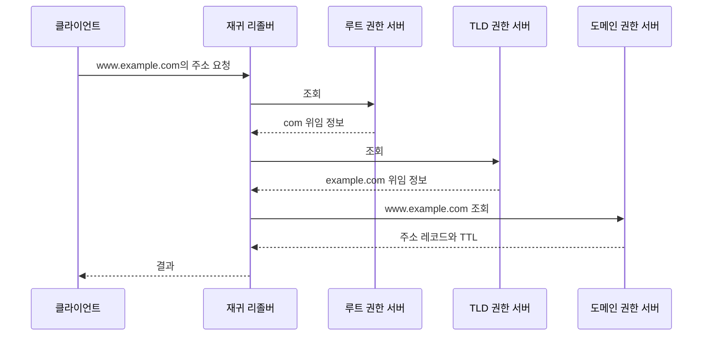

# 2-3. DNS 등록과 이름 해석

[목차](../README.md) · [이전](02-packets.md) · [정답·해설](03-dns-answers.md)

예상 60분. 목표: 도메인 등록·DNS 위임·레코드 설정·조회·캐시를 구분하고, 변경 시 장애와 지연을 설명합니다.

## 1. 도메인을 샀는데 사이트가 안 열리는 이유

도메인 등록은 이름을 일정 기간 사용할 권리를 등록하는 일입니다. 웹서버 생성, DNS 레코드 작성, TLS 인증서 준비가 모두 자동으로 끝난다는 뜻은 아닙니다. 업체가 한 화면에서 여러 서비스를 제공해도 논리적 역할은 다릅니다.

| 역할 | 하는 일 | 혼동하지 말 것 |
| --- | --- | --- |
| 등록자 registrant | 도메인을 등록·관리하는 주체 | 웹사이트 방문자 |
| 등록대행자 registrar | 등록·갱신·이전 등 고객 절차 제공 | 반드시 권한 DNS 운영자라는 뜻은 아님 |
| 레지스트리 registry | 해당 TLD의 등록 데이터·위임 체계 관리 | 전 세계 모든 개별 A 레코드의 저장소가 아님 |
| 권한 DNS 서버 | 담당 zone의 레코드에 대해 응답 | 일반 사용자를 대신해 모든 이름을 찾는 리졸버와 구별 |
| 재귀 리졸버 | 클라이언트 대신 조회하고 결과 캐시 | 도메인 소유자의 원본 설정 그 자체가 아님 |

TLD는 `.com`, `.org` 같은 최상위 도메인입니다. 등록 정책과 제공 기능은 TLD·업체마다 다릅니다. DNS의 **zone**은 관리·권한의 단위이며 도메인 이름 아래의 모든 하위 이름과 항상 같은 범위는 아닙니다. 하위 영역을 따로 위임할 수 있습니다.

## 2. 등록부터 서비스까지

1. 등록 가능 여부·비용·갱신·소유자 정보를 확인하고 등록합니다.
2. 권한 DNS 서비스를 선택하고 zone과 필요한 레코드를 준비합니다.
3. 등록 관리에서 해당 이름의 권한 nameserver로 위임하도록 설정합니다. 이 정보가 상위 zone의 위임에 반영됩니다.
4. A/AAAA 또는 적절한 별칭으로 서비스의 진입점에 연결합니다. 실제 서버·프록시에서도 호스트명에 맞는 서비스를 구성합니다.
5. HTTPS를 위해 해당 호스트명에 맞는 인증서를 준비하고 자동 갱신을 설정합니다.
6. 권한 응답과 재귀 조회, 실제 HTTPS 응답을 각각 확인합니다.

이 절차는 개념 설명입니다. 실제 유료 등록이나 도메인 설정 변경을 실행하지 않습니다. DNSSEC를 쓰는 경우 DS 등 상위 위임과 서명 체인의 일치도 별도로 확인해야 합니다.

## 3. 조회 흐름: 캐시 미스의 단순 모델

매번 루트부터 가는 것은 아닙니다. 리졸버가 답이나 위임 정보를 캐시할 수 있고, 다른 리졸버로 전달하는 forwarder를 사용할 수도 있습니다. 브라우저가 자체 보안 DNS를 사용하면 OS의 기본 경로와 다를 수 있습니다. 실제 QNAME minimization 등은 이 그림보다 질의 범위를 줄일 수 있습니다.

## 4. 자주 쓰는 레코드

| 종류 | 역할 | 선택·주의점 |
| --- | --- | --- |
| A | 이름→IPv4 주소 | 이름에 URL 경로나 포트를 넣는 기능이 아님 |
| AAAA | 이름→IPv6 주소 | 서버·방화벽·경로도 IPv6로 동작해야 함 |
| CNAME | 별칭 이름→다른 이름 | 일반적으로 같은 이름의 다른 데이터와 공존 제한, 연쇄 조회 비용 |
| NS | zone의 권한 서버 정보 | 단순 웹서버 IP 변경과 위임 변경은 다름 |
| MX | 메일을 받을 서버 | 웹 접속 주소와 목적이 다름 |
| TXT | 텍스트 정보 | 도메인 검증·메일 정책 등 각 사용 규약에 따라 해석 |
| SOA | zone의 기본 관리 정보 | serial·타이머 등, 일반 주소 레코드와 다른 역할 |

일반 CNAME을 zone apex에 그냥 둘 수 없는 이유는 그 이름에 SOA·NS 등 필요한 데이터가 있기 때문입니다. 업체의 ALIAS/ANAME·flattening 같은 기능은 일반 CNAME과 같은 규격의 레코드라고 가정하지 말고 동작·갱신 방식을 확인합니다. 최신 HTTPS/SVCB 레코드는 서비스 연결 정보를 더 제공할 수 있지만 기본 주소·위임과 역할을 구분하세요.

## 5. TTL과 ‘전파’의 실제 의미

TTL은 레코드가 캐시에 머무를 수 있는 기간을 나타냅니다. 권한 서버에서 바꾼 값을 모든 리졸버로 한꺼번에 밀어 넣는 방송 시간이 아닙니다. 기존 캐시·권한 서버 간 갱신·클라이언트 동작 때문에 다른 값이 관찰될 수 있습니다. 존재하지 않는 이름에 대한 응답도 negative caching될 수 있습니다.

학습용 예: 12:00에 리졸버가 TTL 3600초인 기존 주소를 받았습니다. 12:10에 권한 레코드를 새 주소와 TTL 60초로 바꿔도 이미 받은 캐시의 남은 수명이 60초가 되는 것은 아닙니다. 일반적인 TTL 모델에서는 기존 값이 13:00까지 남을 수 있습니다. 실제 리졸버의 조기 퇴출·최소/최대 TTL·serve-stale 정책 등 예외가 있으므로 ‘정확히 전 세계가 13:00에 바뀐다’고 말하지 않습니다.

| TTL 선택 | 얻는 이익 | 감수할 비용 |
| --- | --- | --- |
| 짧게 | 재조회가 자주 일어나 주소 변화 반영이 쉬움 | 질의·권한 서버 의존 증가, 캐시 이점 감소 |
| 길게 | 조회·지연·권한 서버 부하 감소 | 이전 주소가 오래 사용될 수 있음 |

계획된 변경은 기존 TTL을 고려해 미리 낮추고 충분한 시간을 둡니다. 새 진입점의 서비스·인증서를 먼저 준비하고, 이전 진입점도 관찰하며 유지합니다. DNS 변경은 기존 TCP/QUIC 연결을 자동으로 새 서버로 옮기지 않습니다.

## 6. 장애를 어느 층에서 볼까

| 관찰 | 확인할 후보 |
| --- | --- |
| 이름 자체를 찾지 못함 | NXDOMAIN, 잘못된 이름·zone·위임, negative cache |
| SERVFAIL | 권한 서버 도달·서명 검증·응답 처리 등 여러 원인 |
| 주소는 맞는데 연결 안 됨 | 포트·방화벽·서버·라우팅·IPv6 경로 |
| 연결은 되지만 인증서 오류 | 호스트명·인증서·신뢰 체인·유효 기간 |
| 일부 사용자만 예전 서비스 | 리졸버·클라이언트 캐시, 기존 연결, CDN·앱 캐시 |

`dig` 등의 DNS 결과만으로 애플리케이션이 정상이라는 결론은 내리지 않습니다. 브라우저와 진단 도구가 다른 리졸버를 쓸 수도 있습니다. 프록시 환경에서는 이름 해석 위치도 달라질 수 있습니다.

## 적용 과제

운영 DNS를 바꾸지 않고 시간표를 작성합니다. 현재 TTL이 1시간이고 내일 15시에 주소를 바꿀 계획입니다. TTL 사전 조정, 새 서버·인증서 준비, 전환, 구 서버 유지, 확인·복구를 배치하세요. ‘DNS만 되돌리면 모든 사용자가 즉시 돌아온다’는 가정을 배제하세요. 실제 명령 실습은 이 편에서 실행하지 않았습니다.

## 퀴즈

Q1·Q2 각 1점, Q3·Q4 각 2점, Q5 4점. 권장 통과 8점.

### Q1
registrar와 재귀 리졸버의 역할은 같은가요? 각각 한 문장으로 설명하세요.

### Q2
A 레코드에 `https://server.example/path`를 넣어 특정 경로로 보낼 수 있나요?

### Q3
TTL 3600 응답을 12:00에 받은 리졸버가 있습니다. 12:10에 권한 값과 TTL을 60으로 바꿨습니다. 기존 캐시가 12:11에 반드시 만료하나요? 이유를 쓰세요.

### Q4
DNS 조회는 새 IP인데 브라우저는 예전 서버로 요청합니다. 가능한 원인 두 가지를 적으세요.

### Q5
계획된 DNS 전환의 준비·확인·복구 절차를 만드세요. TTL, 서비스 준비, 기존 연결·구 서버, DNS와 앱의 별도 검증을 포함합니다.

## 출처

2026-10-01 확인. 상업적 등록 절차는 업체 정책에 따라 달라집니다.

- [RFC 1034 §2~5](https://www.rfc-editor.org/rfc/rfc1034.html): 계층·zone·위임·리졸버 기본 모델.
- [RFC 9499, DNS Terminology](https://www.rfc-editor.org/rfc/rfc9499.html): 현재 DNS 용어, TTL·캐시·위임의 구분.
- [MDN, What is a domain name?](https://github.com/mdn/content/blob/main/files/en-us/learn_web_development/howto/web_mechanics/what_is_a_domain_name/index.md): 이름 구조·등록·갱신·DNS 연결의 입문 설명.
