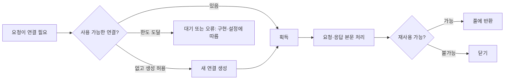

# 2-5. 연결 재사용과 커넥션 풀

[목차](../README.md) · [이전](04-transport.md) · [정답·해설](05-connections-answers.md)

예상 50분. 목표: HTTP 지속 연결·TCP keepalive·풀의 차이를 설명하고, 연결 수와 요청 동시성·대기 예산을 설계합니다.

## 1. 매번 연결하면 생기는 비용

API 호출마다 새 클라이언트를 만들고 닫으면 DNS·연결·TLS 협상·상태 초기화 비용을 반복할 수 있습니다. 같은 목적지에 자주 요청한다면 이미 만든 연결을 재사용하는 편이 유리할 수 있습니다. 다만 ‘연결은 영원히 살아 있다’거나 ‘같은 목적지면 어떤 사용자 상태도 섞어도 된다’는 뜻은 아닙니다.

HTTP/1.1은 원칙적으로 지속 연결이 기본입니다. 메시지의 끝을 `Content-Length`나 전송 프레이밍 등으로 구분할 수 있어야 다음 메시지를 같은 연결에서 해석할 수 있습니다. 응답 본문을 끝까지 소비하지 않으면 안전하게 재사용할 수 없거나 라이브러리가 연결을 버릴 수 있습니다.

## 2. keep-alive라는 이름의 서로 다른 기능

| 기능 | 무엇을 하는가 | 무엇을 하지 않는가 |
| --- | --- | --- |
| HTTP 지속 연결 | 여러 요청·응답에 같은 연결 재사용 | 앱의 생존·응답 기한을 보장하지 않음 |
| TCP keepalive | 유휴 연결에 탐침을 보내 사라진 상대를 발견하는 데 도움 | HTTP 요청을 보내거나 업무 상태를 확인하지 않음 |
| 앱 heartbeat | 앱이 정한 메시지로 활성·상태 확인 | 모든 경로·업무 기능 정상의 보증은 아님 |
| 풀 idle timeout | 오래 쓰지 않은 자원을 닫거나 교체 | 현재 진행 중인 요청 전체 시간 제한과 다름 |

이름이 비슷한 서버 설정을 보고 요청 타임아웃으로 사용하면 잘못된 보호가 생깁니다. 예를 들어 Uvicorn의 keep-alive 제한은 일반적인 전체 요청 실행 deadline이 아닙니다.

## 3. 커넥션 풀의 수명

풀은 연결의 생성·보관·재사용을 관리하는 장치입니다. 모든 라이브러리의 ‘pool size’가 동시에 진행 중인 요청의 강제 상한은 아닙니다. 어떤 구현은 저장할 유휴 연결 수를 제한하고 필요 시 더 만들며, 어떤 구현은 엄격히 제한해 기다리게 합니다. 대기 시 timeout·overflow·취소의 의미를 문서와 측정으로 확인해야 합니다.

HTTP/1.1 클라이언트는 일반적으로 활성 요청마다 연결을 점유합니다. HTTP/2·3에서는 연결 하나에 여러 스트림이 있으므로 연결 수와 요청 동시성이 다릅니다. 스트림 한도·연결 및 스트림 흐름 제어·서버 자원도 함께 봅니다.

## 4. 작게·크게 잡을 때 감수하는 비용

| 정책 | 이익 | 비용·위험 |
| --- | --- | --- |
| 작은 엄격한 풀 | 다운스트림 부하·소켓 수 제한 | 획득 대기·timeout, 긴 요청의 점유 |
| 큰 풀 | 동시 I/O 처리 여유 | 메모리·FD·서버 연결 부담, 병목을 뒤로 밀 수 있음 |
| 긴 유휴 유지 | 재사용 가능성 증가 | 쓰지 않는 연결 자원, 서버가 먼저 닫은 연결 |
| 짧은 유휴 유지 | 오래된 자원 정리 | 핸드셰이크·재연결 비용 증가 |

FD는 운영체제가 열린 파일·소켓 등을 다룰 때 쓰는 파일 디스크립터입니다. 풀이 커져도 DB·외부 API의 실제 처리 능력이 늘어나는 것은 아닙니다. 실패를 대기열에 오래 숨기지 않도록 전체 deadline 안에 연결 획득·연결·읽기 예산을 배치합니다.

학습용 근사: 한 연결이 한 번에 요청 하나를 처리하고 평균 점유 시간이 0.2초이며 포화 상태에서 쉬지 않는다면 연결 10개의 상한 근사는 `10 / 0.2 = 50요청/초`입니다. 이는 실제 보장 처리량이 아닙니다. 꼬리 지연, 점유 시간 변화, 재시도, 다른 병목, 부하 변동, 안전 여유가 빠져 있습니다. HTTP/2의 스트림에도 이 숫자를 연결 개수만으로 그대로 적용할 수 없습니다.

멀티프로세스에서는 대개 각 프로세스가 별도 풀을 갖습니다. 인스턴스 3개×워커 4개×최대 연결 10이면 해당 대상에 대해 최대 120개를 계획해야 할 수 있습니다. 풀의 정의, 대상별 분리, overflow, 다른 작업의 연결도 확인하세요. 프로세스 간 소켓을 무분별하게 공유하면 안 됩니다.

## 5. 수명·상태를 설계하기

요청마다 클라이언트를 만드는 대신 프로세스 시작·종료 수명에 맞추는 방법을 고려합니다. 동시 사용의 안전성은 SDK마다 다르므로 확인해야 합니다. HTTP 클라이언트는 쿠키 저장소나 기본 인증 정보를 가질 수 있습니다. 서버 사용자 여러 명의 인증 상태를 공유 클라이언트의 가변 기본값에 덮어쓰면 사용자 간 정보가 섞일 수 있습니다.

서버가 유휴 연결을 닫는 것은 정상입니다. 클라이언트는 이를 처리해야 하지만, 실패한 쓰기 요청을 무조건 다시 보내면 중복 부작용이 생길 수 있습니다. 연결 복구와 앱 재시도 정책을 함께 설계합니다.

## 적용 과제

인스턴스 2개, 워커 3개, 워커별 HTTP/1.1 최대 연결 8개, 평균 점유 0.1초라는 가정으로 연결 예산과 이상적인 상한을 계산하세요. 외부 API가 200요청/초만 허용한다면 왜 풀을 더 늘리는 것으로 해결되지 않는지 설명하세요.

실제 재사용 확인은 [2-6의 표준 라이브러리 실습](06-http.md)에서 합니다. 해당 실습은 한 연결 재사용을 보여 주며 여러 연결을 관리하는 상용 SDK의 풀 동작을 측정하는 것은 아닙니다.

## 퀴즈

Q1·Q2 각 1점, Q3·Q4 각 2점, Q5 4점. 권장 통과 8점.

### Q1
TCP keepalive를 켜면 3초 이상 걸리는 HTTP 요청이 자동으로 취소되나요?

### Q2
HTTP/2 연결 1개는 동시 요청도 반드시 1개인가요?

### Q3
프로세스 6개가 각각 대상별 최대 연결 12개짜리 풀을 하나씩 갖습니다. 단순 최대 연결 예산은? 추가로 확인할 요소 하나는?

### Q4
풀 대기가 늘었습니다. 크기를 늘리기 전에 확인할 원인 두 가지를 쓰세요.

### Q5
매 요청마다 새 HTTP 클라이언트를 만드는 서비스를 개선하려 합니다. 수명·동시 사용·인증 상태·한도·timeout·검증을 포함한 계획을 작성하세요.

## 출처

2026-10-01 확인. SDK 풀은 구현별로 달라 제품별 한도를 이 편에서 고정하지 않습니다.

- [RFC 9112 §9.3~9.4](https://www.rfc-editor.org/rfc/rfc9112.html#section-9.3): 지속 연결, 본문 소비, 동시 연결.
- [RFC 9293 §3.8.4](https://www.rfc-editor.org/rfc/rfc9293.html#section-3.8.4): TCP keepalive.
- [MDN, Connection management in HTTP/1.x](https://github.com/mdn/content/blob/main/files/en-us/web/http/guides/connection_management_in_http_1.x/index.md): 지속 연결과 pipelining의 입문 비교. 브라우저 연결 개수는 고정 규격값이 아닙니다.
