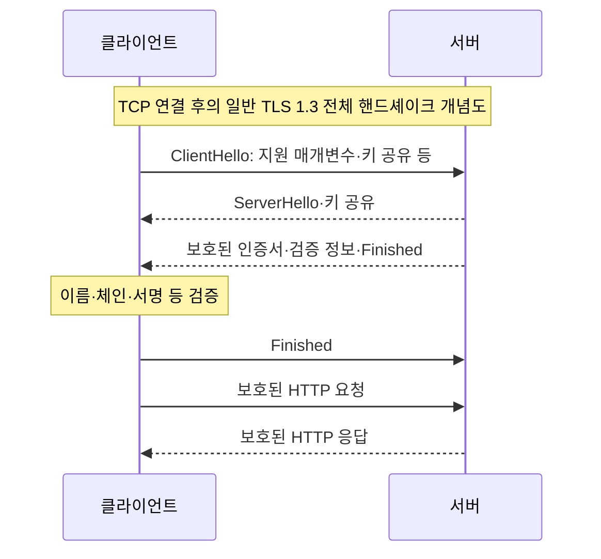

# 2-7. HTTPS와 TLS: 어디까지 신뢰할 수 있나

[목차](../README.md) · [이전](06-http.md) · [정답·해설](07-tls-answers.md)

예상 50분. 목표: 기밀성·무결성·상대 인증을 구분하고, 인증서 검증과 TLS 종료 위치를 이해하며, 재사용·재개·0-RTT의 비용을 설명합니다.

## 1. HTTPS가 해결하는 문제

HTTP를 관찰·변조할 수 있는 네트워크에서 암호화 없이 보내면 중간 장치가 내용을 읽거나 바꿀 수 있습니다. HTTPS는 TLS 등 보안 전송 위에서 HTTP를 교환하여 이러한 위험을 줄입니다. 브라우저와 공개 웹서버 사이의 일반적인 인증서 기반 HTTPS를 기준으로 설명합니다.

| 성질 | 보호하는 것 | 보장하지 않는 것 |
| --- | --- | --- |
| 기밀성 | 종단 사이에서 암호화된 내용 | 악성 종단, 길이·타이밍 등 모든 메타데이터의 은닉 |
| 무결성 | 통신 내용의 변조 탐지 | 앱이 잘못 계산한 값의 교정 |
| 상대 인증 | 검증한 이름에 대해 서버가 정당한 키를 보유하는지 | 그 사이트의 사업·게시 내용이 정직한지 |

인증서가 있다고 안전한 사업자가 되는 것은 아닙니다. HTTPS 페이지의 XSS·권한 버그·사용자에게 잘못된 정보를 주는 문제는 별도입니다. TLS가 종료되는 종단에서는 내용이 복호화됩니다.

## 2. 인증서와 키의 역할

인증서는 이름·공개키 등의 정보를 발급자의 서명으로 연결합니다. 클라이언트는 신뢰할 수 있는 루트까지의 체인, 유효 기간, 접속 이름과 인증서 이름의 일치 등을 정책에 따라 검증합니다. 서버는 대응하는 개인키의 보유를 증명합니다. 폐기 확인·인증서 투명성 등 세부 검증은 클라이언트·환경의 정책도 봐야 합니다.

공개키 암호와 대칭키 암호는 역할이 다릅니다. 일반적인 TLS 1.3 전체 핸드셰이크에서는 임시 키 교환과 서명을 이용해 상대를 인증하고 공유 키 재료를 만들며, 실제 데이터를 효율적인 대칭키 기반 방식으로 보호합니다. **서버의 인증서 공개키로 모든 HTTP 본문을 직접 암호화한다**고 설명하면 부정확합니다. PSK·세션 재개 등 다른 경로도 있습니다.

이는 패킷 개수나 모든 메시지의 경계를 나타내는 그림이 아닙니다. TCP 설정 시간, TLS 버전, 추가 왕복, 재개 여부, QUIC 사용에 따라 실제 왕복 비용이 달라집니다. TLS가 항상 특정 횟수의 왕복을 요구한다고 외우지 않습니다.

## 3. 종료 위치가 신뢰 경계를 만든다

| 구조 | 이익 | 감수할 비용·확인 |
| --- | --- | --- |
| LB에서 TLS 종료 후 내부 HTTP | 인증서·정책 중앙 관리, 앱 구성 단순 | LB~앱 구간은 그 TLS로 보호되지 않음. 네트워크 경계 평가 필요 |
| LB 종료 후 앱까지 재암호화 | 두 구간의 전송 보호 | 추가 인증서·검증·운영, LB는 여전히 평문을 봄 |
| TLS passthrough | 앱이 TLS 종단, 중간 LB가 HTTP 평문을 보지 않음 | HTTP 내용 기반 라우팅·검사 제약, 앱 인증서 운영 |
| mTLS | 양쪽 인증서로 통신 상대 검증 | 클라이언트 인증서 발급·회전·폐기·권한 연결 비용 |

내부망이라고 항상 신뢰할 수 있는 것은 아닙니다. 반대로 모든 구간에 같은 복잡성을 추가할지 여부는 위협 모델·운영 역량·요구에 따라 판단합니다. mTLS가 서비스의 신원을 확인해도 그 신원이 어떤 업무를 할 권한이 있는지는 앱의 인가 규칙이 필요합니다.

TLS 종료 프록시 뒤에서 앱이 원래 scheme·호스트·클라이언트 주소를 알아야 한다면 전달 헤더를 사용합니다. 외부 사용자가 임의로 넣은 `X-Forwarded-*`를 그대로 신뢰하면 안 됩니다. 신뢰하는 프록시와 헤더 정리 범위를 정해야 합니다.

## 4. 재사용·재개·0-RTT

| 방법 | 줄이는 비용 | 조건·단점 |
| --- | --- | --- |
| 기존 연결 재사용 | 새 연결·핸드셰이크 | 유휴 자원, 종료 감지, 수명 관리 |
| TLS 세션 재개 | 이전 보안 문맥을 활용한 협상 비용 | 재개 정보 수명·키 관리, 지원 조건 |
| 0-RTT early data | 일부 상황에서 요청 전송을 더 일찍 시작 | 재개 등의 조건, 재전송 공격 위험, 거절·재시도 처리 |

0-RTT는 아무 서버에 첫 접속부터 모든 작업을 0ms에 끝낸다는 뜻이 아닙니다. early data에는 재전송 공격 위험이 있어 결제·상태 변경처럼 중복이 위험한 요청에 무조건 허용하면 안 됩니다. GET도 실제 구현이 부작용을 일으키는지 확인해야 합니다. 암호화됐다는 사실만으로 재실행에 안전한 것은 아닙니다.

## 5. 인증서 오류를 만났을 때

호스트명·시각·인증서 체인·유효 기간·신뢰 저장소·TLS 종료 지점을 확인합니다. 기업 프록시가 있다면 승인된 CA 신뢰 경로가 설정됐는지 살핍니다. 검증을 끄는 `verify=False`나 `-k`를 일반 해결책으로 만들지 않습니다. 인증서 갱신은 성공했지만 실제 LB에 새 인증서가 반영되지 않은 상황도 있을 수 있습니다.

**관찰 과제:** 브라우저 보안 정보에서 접속 호스트·인증서 이름·발급자·기간을 확인하고, 네트워크 구성을 그려 복호화되는 지점을 표시하세요. 브라우저 UI 항목은 버전마다 다릅니다. 이 브라우저 관찰은 본 환경에서 실행하지 않았습니다.

## 퀴즈

Q1·Q2 각 1점, Q3·Q4 각 2점, Q5 4점. 권장 통과 8점이며 Q3·Q4를 틀리면 복습하세요.

### Q1
정상 HTTPS 인증서는 사이트가 제공하는 투자 정보가 사실임을 보장하나요?

### Q2
일반 TLS 1.3에서 인증서의 공개키로 모든 본문을 직접 암호화하나요?

### Q3
브라우저~LB만 TLS이고 LB~앱은 HTTP입니다. “전 구간 암호화”라는 설명이 맞나요? 실제 평문 노출 범위를 쓰세요.

### Q4
0-RTT로 결제 생성 요청을 보내려 합니다. 얻는 이득과 추가로 해결할 위험을 적으세요.

### Q5
프록시 뒤 앱에서 인증서 오류를 해결하려고 검증을 끄자는 제안이 나왔습니다. 진단 순서와 안전한 수정 방향, 수정 후 검증할 것을 작성하세요.

## 출처

2026-10-01 확인.

- [RFC 8446 §1~2, §8](https://www.rfc-editor.org/rfc/rfc8446.html#section-8): TLS 1.3 보장·핸드셰이크·0-RTT 재전송 위험.
- [RFC 9110 §4.2.2, §4.3.4](https://www.rfc-editor.org/rfc/rfc9110.html#section-4.3.4): HTTPS와 인증서 검증.
- [RFC 9114 §1.2](https://www.rfc-editor.org/rfc/rfc9114.html#section-1.2): QUIC에 통합되는 TLS와 HTTP/3.
