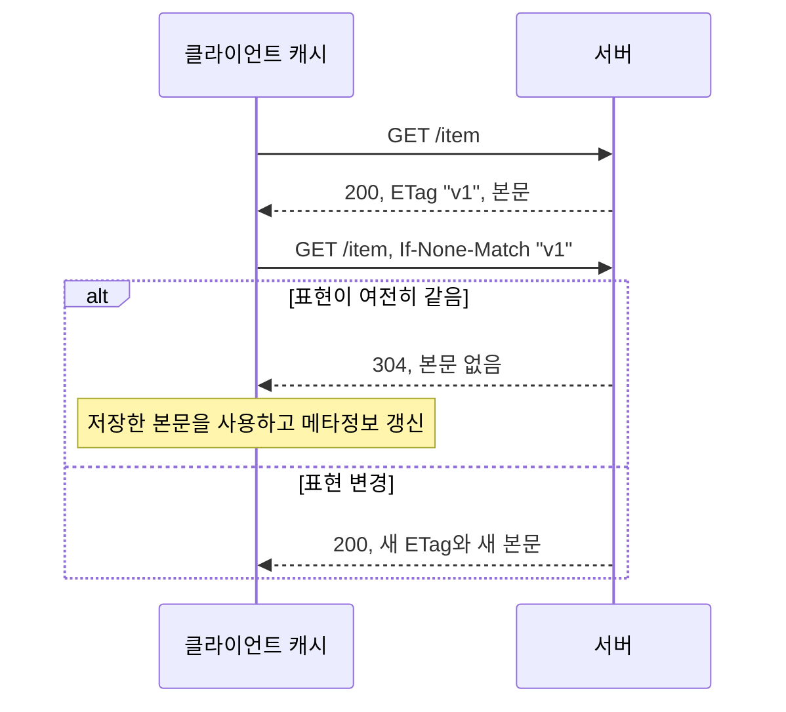

# 2-8. HTTP/1.1과 주요 헤더

[목차](../README.md) · [이전](07-tls.md) · [정답·해설](08-headers-answers.md)

예상 60분. 목표: 헤더를 역할별로 읽고, 메시지 경계·캐시·인증·재시도 정책을 구분하며, 조건부 조회를 설명합니다.

## 1. HTTP/1.1의 기본 형태와 경계

HTTP/1.1은 시작줄과 필드, 빈 줄, 필요한 경우 본문으로 메시지를 표현합니다. 지속 연결에서 메시지의 끝을 알아야 다음 요청·응답을 해석할 수 있습니다. `Content-Length`는 문자 개수가 아니라 **전송되는 콘텐츠의 바이트 수**입니다. 한국어 문자열 길이와 UTF-8 바이트 길이는 다를 수 있습니다.

길이를 미리 모르는 HTTP/1.1 메시지는 적절한 `Transfer-Encoding: chunked` 등 프레이밍을 사용할 수 있습니다. 특정 상태·메서드는 본문 규칙이 다릅니다. HEAD·204·304를 단순히 본문 있는 200처럼 구현하면 안 됩니다. 프록시와 서버의 길이 해석이 달라지면 요청 경계가 어긋나는 보안 문제도 생기므로 직접 불완전한 파서를 만들지 않습니다.

필드 이름은 대소문자를 구분하지 않지만 값은 각 필드 규칙을 따릅니다. 모든 중복 필드를 무조건 쉼표로 합치면 안 되며 `Set-Cookie` 같은 예외가 있습니다. HTTP/2·3에서는 필드 표현과 금지되는 연결 전용 필드가 다릅니다.

## 2. 역할별 헤더 지도

| 필드 | 요청/응답에서의 역할 | 설계 시 확인 |
| --- | --- | --- |
| Host | HTTP/1.1 요청 대상 호스트 | 필수 대상 정보, 허용 호스트·프록시 설정 |
| Content-Type | 담긴 콘텐츠의 미디어 타입 | 파싱 방식·charset, 실제 내용과 일치 |
| Accept | 클라이언트가 원하는 응답 표현 | Content-Type과 방향이 다름 |
| Content-Length | 바이트 길이·일부 메타정보 | 상태·메서드별 규칙, 정확한 프레이밍 |
| Authorization | 요청의 자격 정보 | 비밀 로그 제외, 검증·권한·캐시 정책 |
| Cookie / Set-Cookie | 저장된 쿠키 전송 / 서버의 쿠키 설정 | Domain·Path·Secure·HttpOnly·SameSite |
| Cache-Control | 캐시 저장·재사용 정책 | 개인/공유 캐시, 신선도·재검증 |
| ETag / If-None-Match | 표현 식별자 / 조건부 비교 | 변경 시 validator 갱신, 표현 변형 구분 |
| Vary | 응답 선택에 영향을 준 요청 필드 | 캐시가 표현을 섞지 않게 키 분리 |
| Location | 리다이렉트·생성 리소스 위치 등 | 상태 코드와 함께 해석 |
| Retry-After | 후속 시도 전에 기다릴 시간 안내 | 초 또는 HTTP 날짜, 자체 retry budget |
| Connection | HTTP/1.x의 해당 홉 연결 옵션 | 종단 앱 의미와 구분, HTTP/2·3에 그대로 전달 금지 |

쿠키의 `HttpOnly`는 JavaScript가 쿠키 값을 읽는 것을 제한하지만 모든 XSS 피해를 막지는 않습니다. `Secure`는 적절한 보안 연결로 전송하도록 하는 속성이고 CSRF 문제를 혼자 해결하지 않습니다. 상세한 저장 방식은 인증 장에서 다룹니다.

## 3. 캐시 지시자의 중요한 차이

| 응답 정책 | 의미 | 이익 | 비용·한계 |
| --- | --- | --- | --- |
| `max-age=60` | 신선도 수명을 60초로 지정 | 신선한 응답은 재요청 감소 | 그 범위에서 오래된 값 가능, Age 등 함께 고려 |
| `no-cache` | 재사용 전 성공적인 검증 필요 | 저장된 본문을 재활용할 수 있음 | 매번 원본 검증 왕복이 필요할 수 있음 |
| `no-store` | 요청·응답을 저장하지 않도록 지시 | 캐시 저장을 제한 | 이미 유출된 데이터 회수·악성 클라이언트 통제는 못 함 |
| `private` | 공유 캐시의 저장 제한 | 사용자별 응답 분리의 한 도구 | 개인 캐시는 저장 가능, 보안 자체의 전부는 아님 |
| `public` | 공유 저장을 허용하는 방향의 명시 | 공통 응답의 공유 효율 | 개인 정보가 담긴 응답에 부주의하게 쓰면 위험 |

`no-cache`는 저장 금지가 아닙니다. `max-age`는 응답을 받은 순간부터 항상 새로 60초를 보장하는 단순 타이머도 아닙니다. 이미 공유 캐시에 머문 시간 등이 `Age`와 날짜를 통해 신선도 계산에 반영됩니다. 인증된 응답의 공유 저장에는 별도의 규칙이 있어 URL이 같다는 이유로 임의로 캐시하지 않습니다.

## 4. ETag를 이용한 조건부 조회

ETag는 반드시 콘텐츠의 암호학적 해시일 필요는 없습니다. 서버가 표현의 변경을 올바르게 나타내도록 만드는 불투명한 validator입니다. strong·weak validator는 비교 목적과 규칙이 다릅니다. 이 편의 단순 실습은 문자열 하나를 비교하지만 실제 구현은 헤더의 목록·와일드카드·비교 규칙을 따라야 합니다.

304는 본문 전송량을 줄일 수 있지만 원본 요청 자체를 없애지는 않습니다. 서버가 매번 비싼 계산을 끝내고 ETag를 만든다면 계산 비용은 그대로일 수도 있습니다. 변경 버전으로 값 검증이 가능한지와 정확성을 함께 설계하세요.

## 5. Vary와 개인화

동일 URL이 `Accept-Language`에 따라 한국어·영어를 반환한다면, 적절한 `Vary: Accept-Language`는 캐시가 두 표현을 구분하는 데 도움을 줍니다. 실제 표현 선택이 해당 필드에 의존할 때 설정합니다.

모든 요청 필드를 `Vary`에 넣으면 캐시 키가 과도하게 늘거나 재사용이 거의 없어질 수 있습니다. 사용자별 쿠키 전체에 의존하는 응답을 무턱대고 공유 캐시에 저장하지 말고, private/no-store·명확한 개인화 경계 등을 고려합니다. `Vary`는 접근 권한을 검증하는 보안 장치가 아닙니다.

## 6. HTTP/1.1의 동시성과 제한

연결을 재사용한다고 하나의 연결에서 HTTP/2처럼 독립 응답 프레임을 다중화하는 것은 아닙니다. HTTP/1.1 pipelining은 응답을 기다리지 않고 다음 요청을 보내는 기능이지만 서버 응답은 요청 순서를 지켜야 합니다. 앞 응답이 느리면 뒤 응답이 기다립니다. 실제 브라우저에서 널리 사용되지 않아 여러 연결을 여는 방식이 흔했습니다.

브라우저가 특정 호스트에 여섯 연결을 여는 사례는 구현 관행이지 RFC가 정한 절대 개수가 아닙니다. 연결을 늘리면 병렬성이 생기지만 자원·혼잡 비용도 늘어납니다. HTTP/2·3은 다음 편에서 비교합니다.

## 실행·관찰 과제

[2-6의 실습 코드](../labs/http_semantics.py)를 실행하고 응답의 ETag, Cache-Control, 연결 식별자를 코드와 대조하세요. 실습은 사용자 에이전트의 완전한 캐시가 아니라 수동 조건부 요청입니다. 304 본문이 비었는데도 왜 원래 표현을 알고 있는 클라이언트에게 유용한지 설명하세요.

추가 설계 과제: 공개 상품 설명, 내 결제 내역, 매분 바뀌는 공지의 캐시 정책을 각각 작성합니다. 같은 정책을 세 곳에 적용하지 말고 신선도·개인정보·원본 부하를 비교하세요. 실제 운영 헤더 변경은 수행하지 않습니다.

## 퀴즈

Q1·Q2 각 1점, Q3·Q4 각 2점, Q5 4점. 권장 통과 8점.

### Q1
응답의 `no-cache`와 `no-store`의 차이를 설명하세요.

### Q2
`Content-Type`과 `Accept`는 각각 무엇을 설명하나요?

### Q3
동일 URL의 한국어·영어 응답이 캐시에서 섞입니다. 확인할 헤더와 캐시 키 정책, 그 비용을 쓰세요.

### Q4
ETag 때문에 304가 나왔습니다. 네트워크 왕복과 서버 계산이 모두 사라졌다는 결론이 맞나요?

### Q5
내 결제 내역 응답을 CDN에 `public, max-age=3600`으로 저장하려 합니다. 위험을 설명하고 저장·신선도·권한·검증을 포함한 대안을 제안하세요.

## 출처

2026-10-01 확인.

- [RFC 9110 §8, §12~13, §15](https://www.rfc-editor.org/rfc/rfc9110.html#section-8): 표현 메타정보·협상·조건부 요청·상태.
- [RFC 9111 §4~5](https://www.rfc-editor.org/rfc/rfc9111.html#section-5): 캐시·신선도·Cache-Control.
- [RFC 9112 §6, §9](https://www.rfc-editor.org/rfc/rfc9112.html#section-6): 메시지 경계·지속 연결·pipelining.
