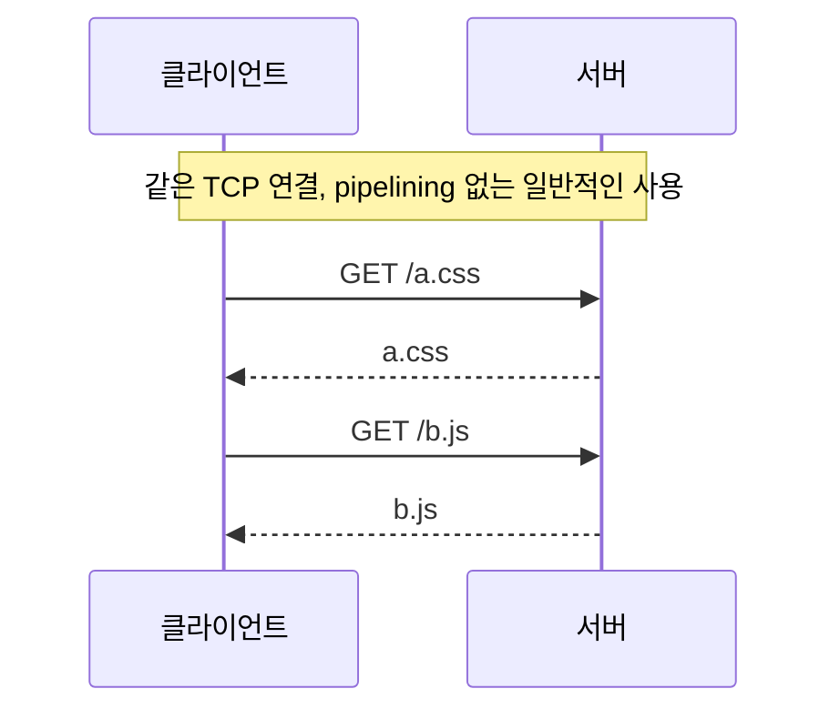
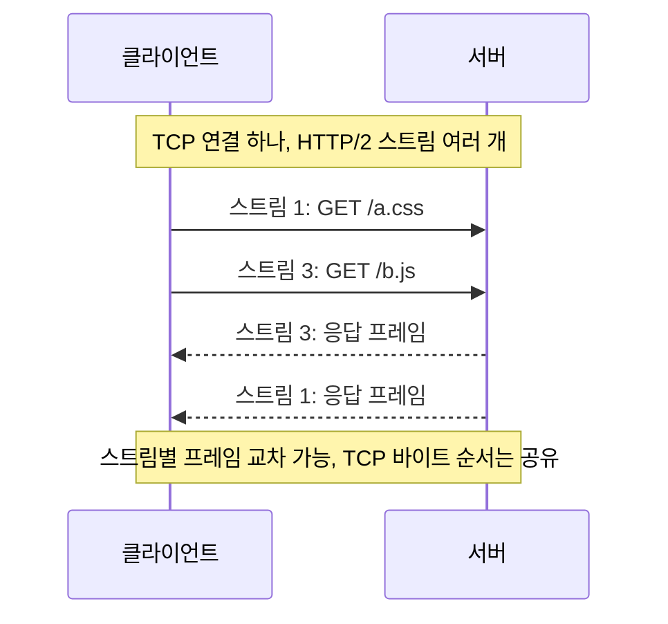
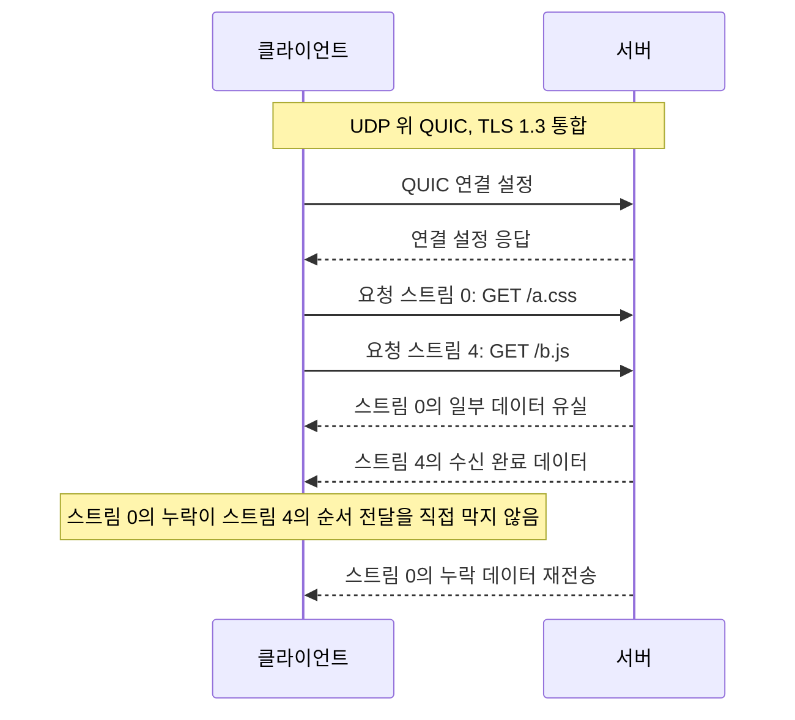

# 2-9. HTTP/1.1·HTTP/2·HTTP/3 비교

[목차](../README.md) · [이전](08-headers.md) · [정답·해설](09-http-versions-answers.md)

예상 60분. 목표: HTTP 의미와 전송 표현을 구분하고, 각 버전이 어떤 대기를 줄이는지, 유실·압축·연결 이동의 남은 비용을 설명합니다.

## 1. 버전이 바뀌어도 남는 것

GET·상태 코드·리소스·많은 헤더의 의미는 HTTP 공통 의미론에 속합니다. HTTP/2나 HTTP/3로 바뀌었다고 앱이 DB를 비동기로 쓰거나 요청 처리량이 자동 증가하는 것은 아닙니다. 주로 메시지를 연결 위에서 표현·다중화하고 전달하는 방식이 바뀝니다.

**다중화**는 여러 논리 스트림을 한 연결에서 구분해 진행하는 방식입니다. 물리 링크를 동시에 무제한으로 쓰는 뜻은 아닙니다. 스케줄링·흐름 제어·혼잡 제어·수신 처리 비용이 남습니다.

## 2. HTTP/1.1: 재사용과 pipelining의 한계

HTTP/1.1은 지속 연결을 지원합니다. pipelining을 쓰면 여러 요청을 미리 보낼 수 있지만 응답 순서를 지켜야 해서 앞 응답 때문에 뒤 응답이 막힐 수 있습니다. 이를 애플리케이션 계층의 **head-of-line blocking(HOL)** 관점에서 설명할 수 있습니다. 여러 TCP 연결은 영향을 나누지만 핸드셰이크·소켓·혼잡 비용을 더 사용합니다.

## 3. HTTP/2: HTTP 스트림은 독립, TCP 전달은 하나

HTTP/2는 바이너리 프레임에 스트림 식별자를 두고 여러 요청·응답을 교차 전달합니다. HPACK으로 헤더를 압축해 반복 메타정보 비용을 줄입니다. 같은 연결 내 응답 순서가 요청 순서에 묶이지 않습니다.

그러나 TCP가 순서 있는 바이트 스트림을 앱에 제공하므로 앞부분이 유실되면 이후 바이트의 전달이 대기할 수 있습니다. HTTP/2는 그 바이트들이 다른 스트림 것이라는 이유로 TCP를 건너뛸 수 없습니다. 이미 앱에 전달된 데이터나 서버의 모든 계산이 정지한다는 뜻은 아니며, **수신 측에서 뒤 바이트를 전달받는 경로**가 묶이는 문제입니다.

## 4. HTTP/3: QUIC가 스트림 단위 전달을 담당

HTTP/3의 클라이언트 시작 양방향 요청 스트림 식별자는 0, 4, 8…입니다. HTTP/2의 1, 3…을 그대로 붙이지 않습니다. 그림은 동작 개념이며 모든 연결 메시지·시간 순서를 엄밀히 재현하지 않습니다.

QUIC는 스트림별 순서·신뢰성을 제공합니다. 한 스트림의 누락이 다른 스트림의 순서 있는 전달을 직접 막는 TCP 방식의 HOL을 줄입니다. 다만 한 QUIC 패킷이 여러 스트림의 데이터를 담았다면 여러 스트림이 동시에 영향을 받을 수 있습니다. 손실된 패킷 자체를 그대로 반복하는 것으로 이해하기보다 필요한 데이터를 새로운 패킷에 재전송한다고 이해합니다.

**남는 공유 비용:** 연결 전체의 혼잡 제어, 연결 수준 흐름 제어, CPU·링크 용량, 제어 스트림·QPACK 헤더 의존성 등이 있습니다. 그러므로 ‘유실돼도 다른 요청에는 아무 영향 없음’은 과장입니다.

## 5. HPACK과 QPACK의 목적

둘 다 헤더 압축으로 전송량을 줄이는 목적을 갖습니다. HTTP/2는 순서 있는 TCP 연결을 전제로 HPACK 상태를 전달할 수 있습니다. QUIC에서는 스트림이 따로 도착하므로 HTTP/3는 QPACK으로 압축 상태 전달과 필드 사용의 의존성을 관리합니다.

압축 상태를 적극 공유하면 헤더 크기를 줄일 수 있지만 아직 도착하지 않은 동적 테이블 항목을 기다리는 문제가 생길 수 있습니다. QPACK은 이를 제어 가능한 형태로 다루며 모든 형태의 대기를 없애는 것은 아닙니다. 개별 HTTP 응답의 gzip·Brotli 본문 압축과 헤더 압축도 구분하세요.

## 6. 연결 이동과 지원 조건

QUIC의 connection ID는 IP·포트가 바뀌어도 같은 연결을 식별하는 데 도움이 됩니다. 따라서 와이파이에서 이동통신으로 바뀔 때 연결을 유지할 수 있습니다. 하지만 경로 검증, 피어 설정, 새 경로의 도달성, 핸드셰이크 상태 등 조건이 있고 언제나 끊김 없이 성공하는 보장은 아닙니다.

UDP가 차단·제한된 환경, 일부 프록시·보안 장비, 서버·클라이언트 미지원 때문에 HTTP/3를 못 쓸 수도 있습니다. HTTP/2 등의 fallback과 실제 사용자군별 실패율을 봐야 합니다. 새 서버를 설치했다고 브라우저가 자동으로 원하는 버전을 사용하는 것은 아닙니다. TLS의 ALPN, HTTP/3 발견·광고, 클라이언트 지원·캐시 등의 협상 경로를 확인합니다.

## 7. 선택표

| 기준 | HTTP/1.1 | HTTP/2 | HTTP/3 |
| --- | --- | --- | --- |
| 대표 전송 | TCP, HTTPS면 TLS | TCP, 웹에서는 보통 TLS | UDP 위 QUIC, TLS 1.3 통합 |
| 동시 처리 표현 | 여러 연결·pipelining 제한 | 한 연결에 여러 HTTP 스트림 | QUIC의 여러 스트림 |
| 헤더 압축 | HPACK/QPACK 없음 | HPACK | QPACK |
| 유실의 순서 전달 영향 | 해당 TCP 연결 | TCP 연결의 여러 스트림에 전파 | 직접적인 순서 대기는 관련 스트림 중심, 공유 제약 남음 |
| 이익 | 넓은 호환성, 단순한 도구 | 연결 수·응답 순서 대기 감소 | 손실·연결 설정·이동에서 개선 가능 |
| 감수할 비용 | 병렬 연결 자원·HTTP HOL | TCP HOL·압축/흐름 상태 | QUIC 운영·CPU·관측·UDP 환경·fallback |

DB 쿼리가 2초 걸리는 API라면 전송 버전만 바꿔 큰 개선을 기대하기 어렵습니다. 많은 리소스·긴 RTT·손실·모바일 이동이 있는 경우 이익이 커질 수 있지만 실제 환경에서 확인해야 합니다.

## 적용 과제: 비교 실험 설계

브라우저의 protocol 표시를 확인하고 ‘활성화 여부’와 ‘성능 효과’를 구분하세요. 비교 계획에는 같은 서버·콘텐츠·클라이언트·캐시 조건, RTT·손실 조건, CPU·오류율·fallback 비율을 포함합니다. 한 번 빠른 결과로 항상 빠르다고 결론 내리지 않습니다. HTTP/2·3 실서버 비교는 이 자료 작성 환경에서 실행하지 않았습니다.

## 퀴즈

Q1·Q2 각 1점, Q3·Q4 각 2점, Q5 4점. 권장 통과 8점.

### Q1
HTTP/1.1에는 응답을 기다리지 않고 다음 요청을 보내는 기능이 규격상 없나요?

### Q2
HTTP/2는 TCP의 순서 전달 때문에 생기는 스트림 간 대기까지 없애나요?

### Q3
‘HTTP/3에서 패킷 유실은 해당 스트림에만 영향을 주고 다른 요청에는 어떤 영향도 없다’는 문장을 두 가지 관점에서 수정하세요.

### Q4
HTTP/3에서 와이파이→이동통신 전환이 항상 무중단인가요? 확인할 조건 두 가지를 적으세요.

### Q5
이미 HTTP/2를 쓰는 모바일 콘텐츠 서비스에 HTTP/3를 도입하려 합니다. 기대 이익, 실패 조건, 비교 지표, fallback, 적용 중단 기준을 설계하세요.

## 출처

2026-10-01 확인. 다이어그램은 표준을 설명하기 위한 재구성입니다.

- [RFC 9112 §9.3.2~9.4](https://www.rfc-editor.org/rfc/rfc9112.html#section-9.3.2): pipelining과 동시 연결.
- [RFC 9113 §1, §5~6](https://www.rfc-editor.org/rfc/rfc9113.html#section-1): HTTP/2 다중화, TCP HOL의 한계, 스트림.
- [RFC 9114 §1.2, §4.2.1, §6.1](https://www.rfc-editor.org/rfc/rfc9114.html#section-4.2.1): QUIC 위 HTTP, QPACK, 요청 스트림.
- [RFC 9000 §2, §9](https://www.rfc-editor.org/rfc/rfc9000.html#section-9): 스트림과 연결 이동의 조건.
