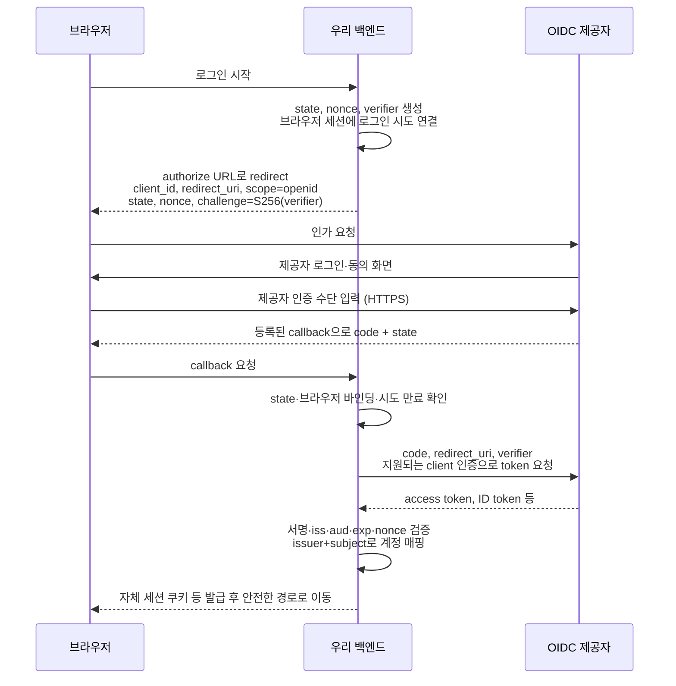

# 6-2. Authorization Code + PKCE 흐름

[목차](../README.md) · [정답·해설](02-code-pkce-answers.md)

예상 55분. 목표: 제공된 로그인 그림의 앞뒤 단계를 보완하고, 비밀번호·secret·verifier의 위치를 구분합니다.

## 1. 원래 그림에 추가할 단계

사용자 비밀번호는 제공자의 로그인 화면으로 전달됩니다. 우리 서비스는 먼저 인가 요청을 만들고, code를 받은 뒤 token endpoint에서 교환합니다. 자체 JWT는 여러 세션 설계 중 하나이며 필수가 아닙니다.

다음은 **백엔드가 있는 confidential client + OIDC**의 설명용 흐름입니다. 제공자가 지원하는 client 인증 방법을 사용하며, public client라면 보관할 수 없는 secret을 앱에 넣지 않습니다.

## 2. PKCE는 어떤 연결을 만드는가

client는 예측하기 어려운 `code_verifier`를 만들고, 인가 요청에는 `BASE64URL(SHA256(verifier))`를 code_challenge로 보냅니다. 교환 시 원래 verifier를 제시하면 제공자가 같은 challenge인지 확인합니다. 중간에서 code만 얻은 공격자가 교환하는 일을 막는 핵심 장치입니다.

verifier는 ASCII unreserved 문자 43~128자 규칙을 따릅니다. S256은 해시를 hex 문자열로 바꾸는 것이 아니라 바이트 digest를 URL-safe base64로 인코딩하고 padding을 제거합니다. 매 로그인 시도 새로 만들고 코드·verifier를 로그에 남기지 않습니다.

## 3. client secret과 PKCE는 대체재가 아니다

서버는 secret을 안전한 서버 저장소에 둘 수 있는 confidential client가 될 수 있습니다. SPA·배포된 모바일 앱은 정적 secret을 사용자에게 숨길 수 없으므로 public client입니다. 프런트엔드 빌드 환경변수에 넣은 문자열도 배포 코드에 포함되면 secret이 아닙니다.

client 인증은 ‘어떤 client인가’, PKCE는 ‘이 code 요청을 시작한 시도의 verifier를 갖고 있는가’에 관계합니다. client secret이 있다고 PKCE를 불필요하게 취급하지 않습니다. RFC 9700은 public client의 PKCE 사용을 요구하고 confidential client에도 권고합니다.

## 4. code를 브라우저로 거치는 이유와 비용

브라우저는 사용자의 제공자 로그인·동의 상호작용을 담당하고 code를 등록된 callback으로 전달합니다. 토큰 교환을 백엔드에서 수행하면 토큰을 브라우저 자바스크립트에 노출하지 않는 구조를 만들 수 있습니다. 대신 백엔드 세션·CSRF 방어·토큰 저장·스케일링을 관리합니다.

redirect URI를 사용자가 보낸 아무 주소로 허용하면 code가 공격자에게 전달될 수 있습니다. 제공자에 등록한 정확한 URI를 사용하고 로그인 후 이동 경로도 내부 허용 경로로 제한합니다. 로컬 native app의 포트 예외 같은 규격상 예외를 임의 wildcard 허용으로 확대하지 않습니다.

## 5. 적용 과제

그림에서 access token, ID token, 자체 세션을 서로 다른 색이라고 상상하고 수신자를 표시하세요. public SPA로 변경하면 secret·token 교환 위치·브라우저 저장·보안 책임이 어떻게 달라지는지도 적습니다.

## 퀴즈

### Q1

PKCE challenge를 만들 때 서버에 먼저 보내는 것은 verifier 원문인가?

### Q2

프런트엔드 번들에 client secret을 넣으면 confidential client가 되는가?

### Q3

인가 요청에 포함할 주요 값 네 가지와 역할을 설명하라.

### Q4

client 인증과 PKCE의 차이는?

### Q5

제공된 원래 그림을 보완하여 시작·callback 검증·토큰 검증·세션 발급 단계를 설명하라.

배점: Q1·Q2 각 1점, Q3·Q4 각 2점, Q5 4점. 8점 이상을 목표로 합니다.

## 출처와 범위

- [OAuth Security BCP, RFC 9700](https://www.rfc-editor.org/rfc/rfc9700.html) — 현대 OAuth 보안 권고.
- [PKCE, RFC 7636](https://www.rfc-editor.org/rfc/rfc7636.html).
- [OpenID Connect Core 1.0](https://openid.net/specs/openid-connect-core-1_0.html) — 인증 계층·ID token·검증 규칙.

확인일: 2026-10-01. 사례의 숫자는 별도 실행 결과 링크가 없으면 설명용 가정입니다.
