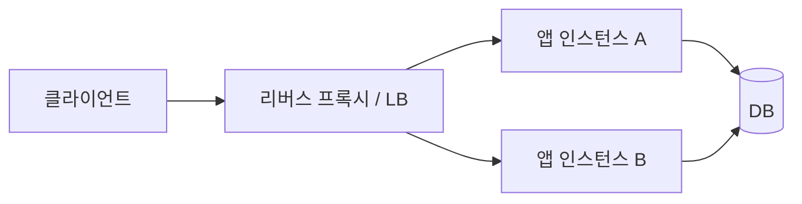

# 8-1. 리버스 프록시와 앱 서버

[목차](../README.md) · [정답·해설](01-proxy-answers.md)

예상 45분. 목표: 프록시가 담당할 경계를 정의하고, 앱 서버 직접 노출을 조건에 따라 평가합니다.

## 1. 요청 경로

리버스 프록시는 서버 앞에서 요청을 받고 내부 대상에 전달합니다. 사용자의 외부 접속을 대리하는 forward proxy와 위치·목적이 다릅니다. nginx는 웹 서버/프록시 기능을 직접 운영하는 선택이고 ALB는 관리형 로드밸런서입니다. 설정·비용·기능·책임 범위가 다릅니다.

## 2. 어떤 일을 앞단에 둘까

TLS 종료, 인증서 갱신, 요청 크기·유입 제한, 느린 클라이언트 대응, 라우팅, access log, health check 같은 기능을 중앙화할 수 있습니다. 모든 프록시가 모든 기능을 같은 방식으로 지원하는 것은 아닙니다. ALB와 nginx의 buffering·timeout을 동일하게 가정하지 않습니다.

Uvicorn을 외부에 노출하는 것이 프로토콜상 불가능한 것은 아닙니다. 하지만 앱 서버만으로 인증서·유입 제어·복수 인스턴스·엣지 공격·운영 정책을 모두 감당할 수 있는지 확인해야 합니다. 관리형 플랫폼이 이미 경계를 제공한다면 nginx를 무조건 추가할 이유도 없습니다.

| 안 | 얻는 것 | 비용 |
| --- | --- | --- |
| 앱 직접 노출 | 단순한 경로 | 외부 트래픽 보호·TLS·확장 책임 직접 부담 |
| nginx 앞단 | 세밀한 제어·버퍼링·정적 파일 | 패치·설정·가용성 운영 |
| 관리형 LB | 운영 부담 감소·대상 관리 | 비용·제품별 제한·벤더 의존 |
| LB+nginx | 역할별 정책 조합 | 홉·중복 timeout·헤더 복잡도 |

## 3. 신뢰할 전달 헤더

TLS를 프록시에서 끝내면 앱에 들어오는 연결은 HTTP일 수 있습니다. 앱이 원래 scheme·host·client IP를 알기 위해 Forwarded/X-Forwarded-* 등을 사용합니다. 외부 사용자가 보낸 값을 무조건 신뢰하면 HTTPS redirect·로그 IP·보안 판단을 조작할 수 있습니다.

앱은 지정된 프록시 경로에서 온 헤더만 신뢰하고, 프록시는 외부 입력을 정리하여 정해진 형식으로 전달합니다. `forwarded-allow-ips='*'`는 앱에 임의 접근할 수 없는 통제된 경로라는 전제가 없으면 위험합니다. 여러 프록시의 체인에서 어느 값을 선택하는지도 설정합니다.

## 4. buffering과 streaming의 비용

응답/요청 buffering은 앱이 느린 클라이언트를 오래 상대하는 일을 줄일 수 있지만 메모리·디스크와 첫 바이트 지연이 늘 수 있습니다. SSE·대용량 streaming은 즉시 전달이 중요하므로 별도 정책이 필요합니다. WebSocket 연결과 짧은 JSON 요청의 timeout·drain 전략도 다릅니다.

## 5. 적용 과제

JSON API, 파일 업로드, SSE를 같은 서비스에서 제공할 때 요청 크기·buffering·idle timeout·신뢰 헤더를 경로별로 표로 만드세요. 설정값을 복사하기 전에 각 기능의 의미를 설명합니다.

### Python 트랙 보강: 직접 노출 여부의 실제 판단

로컬 학습에서는 `uvicorn ... --host 127.0.0.1`로 외부 진입을 제한합니다. 운영에서는 TLS 종료·인증서·요청 크기·유입 제한·느린 클라이언트·접근 로그·신뢰 헤더를 누가 담당하는지 표를 채우세요. 플랫폼 LB가 이미 역할을 수행한다면 nginx를 추가하는 것이 필수는 아닙니다.

프록시 뒤의 앱 포트에 외부가 직접 접근할 수 있으면 앞단 제한을 우회할 수 있습니다. 네트워크 경계와 trusted proxy 설정을 함께 확인합니다. ‘Uvicorn이면 무조건 안전/위험’이라는 이름 기반 결론 대신 어떤 보호 기능과 운영 책임이 빠졌는지 평가합니다.

## 퀴즈

### Q1

리버스 프록시와 forward proxy의 대리 대상은?

### Q2

Uvicorn 앞에 nginx를 추가하면 모든 운영 문제가 해결되는가?

### Q3

전달 헤더를 무조건 신뢰하면 생길 문제 두 가지는?

### Q4

buffering의 이익과 streaming에서의 비용을 비교하라.

### Q5

관리형 LB가 있는 FastAPI 서비스의 앞단 구성을 선택하고 신뢰 경계를 설명하라.

배점: Q1·Q2 각 1점, Q3·Q4 각 2점, Q5 4점. 8점 이상을 목표로 합니다.

## 출처와 범위

- [Uvicorn deployment](https://www.uvicorn.org/deployment/) — 추가 읽기. 이번 접근은 proxy 403이어서 직접 확인하지 못했습니다.
- 4장의 실제 Uvicorn 실험은 워커/연결만 검증했으며 nginx·ALB의 배포 검증은 아닙니다.

확인일: 2026-10-01. 사례의 숫자는 별도 실행 결과 링크가 없으면 설명용 가정입니다.
