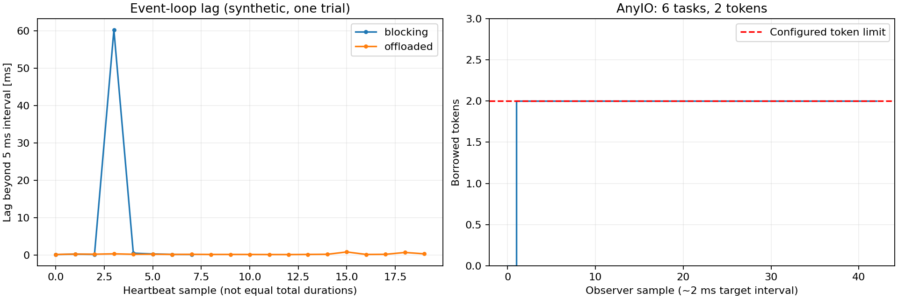

# 9-4. 병목을 보여 주는 지표

[목차](../README.md) · [정답·해설](04-bottleneck-metrics-answers.md)

예상 50분. 목표: 직접 측정한 대기와 대리 지표를 구분하고, 병목 가설을 여러 신호로 확인합니다.

## 1. CPU가 낮아도 요청은 느릴 수 있다

DB 연결을 기다리거나 스레드 토큰을 기다리는 요청은 CPU를 많이 쓰지 않습니다. 평균 CPU 하나로 병목을 결정하지 않습니다. 요청의 전체 시간과 각 단계 대기를 나누고, 활성·대기·완료·실패 수를 같은 시간축으로 봅니다.

| 지표 | 관찰 대상 | 해석의 한계 |
| --- | --- | --- |
| loop lag | 예정된 이벤트루프 실행보다 늦어진 시간 | 동기 코드·CPU 스케줄링·GC 등 원인 구분 필요 |
| AnyIO borrowed/total tokens | 해당 limiter 점유 | 모든 OS 스레드 수가 아님 |
| executor 큐/작업 시간 | 제출 후 실행까지 대기와 실제 실행 | 공개 API/구현별 계측 가능성 |
| 워커별 RSS/PSS | 프로세스 메모리 | 공유·native·allocator·cgroup 차이 |
| DB checkout wait | 풀에서 연결 얻기까지 | SQL 실행·락 대기와 별도 |
| SDK 호출 시간 | 외부 호출 전체 경과 | 연결 획득·네트워크·서버를 자동 분해 못함 |

## 2. boto3 ‘풀 대기’라는 지표 이름을 먼저 검증

4-6에서 확인한 botocore 1.35.99/urllib3 2.8.0 경로는 보관 연결 maxsize와 `block=False`를 사용했습니다. 따라서 11번째 호출이 반드시 풀 획득 대기한다는 모델로 지표를 만들면 잘못된 결론이 됩니다.

직접 얻을 수 있는 호출 시간·retry 수·활성 호출·연결 생성/폐기와, 계측이 필요한 내부 단계 시간을 구분합니다. ‘pool full’ 로그는 보관 한도 초과로 연결을 버리는 상황일 수 있으며 DB QueuePool의 wait와 같지 않습니다.

## 3. loop lag 측정

5ms 간격으로 깨우도록 한 task에서 `실제 경과 - 5ms`를 기록하면 scheduling lag의 한 표본을 얻습니다. 절대적인 이벤트루프 내부 지연의 모든 원인을 알려 주지는 않습니다. 관측 주기보다 짧은 문제를 놓치거나 계측 자체가 비용을 더할 수 있습니다.

[원본 JSON](../results/observability-2026-10-02.json). 왼쪽은 독립 실험의 sample 번호이며 동일한 총시간 축으로 해석하지 않습니다. 오른쪽은 AnyIO 토큰 2개가 6개 작업을 처리하는 동안 점유된 모습입니다. Grafana 실시간 화면이 아닌 저장한 측정값의 그래프입니다.

## 4. 판단 예

loop lag가 크고 thread tokens는 여유라면 루프 블로킹을 먼저 조사합니다. loop lag는 낮고 tokens가 한도에 붙고 요청 지연이 늘면 동기 작업 대기/실행을 조사합니다. DB wait와 DB CPU가 함께 늘면 앱 풀만 키워서 해결될지 신중해야 합니다.

상관관계는 출발점입니다. 한 변수를 바꾸고 원인이 줄었을 때 지표와 사용자 지연이 함께 개선되는지 검증합니다. 클라이언트 부하 발생기 자체가 포화되지 않았는지도 확인합니다.

## 5. 적용 과제

‘CPU 20%, p99 3초, thread tokens 40/40, DB CPU 10%’를 보고 가능한 원인 세 개와 각각 추가로 측정할 지표를 적으세요. 주어진 숫자는 가상의 진단 문제입니다.

## 퀴즈

### Q1

CPU가 낮으면 병목이 없다는 뜻인가?

### Q2

AnyIO tokens=40은 프로세스 전체 스레드가 정확히 40개라는 뜻인가?

### Q3

loop lag가 커질 수 있는 원인 두 가지는?

### Q4

boto3 max_pool_connections를 DB 풀 대기 한도처럼 취급하면 안 되는 이유는?

### Q5

가상의 지표에서 병목 가설과 검증 실험을 설계하라.

배점: Q1·Q2 각 1점, Q3·Q4 각 2점, Q5 4점. 8점 이상을 목표로 합니다.

## 출처와 범위

- [실행한 관측 코드](../labs/observability.py), [4-6 풀 구현](../04-fastapi/06-pools.md).
- 그래프는 Matplotlib 3.10.8로 원본 JSON에서 생성했습니다. 운영 부하의 표본은 아닙니다.

확인일: 2026-10-02. 사례의 숫자는 별도 실행 결과 링크가 없으면 설명용 가정입니다.
