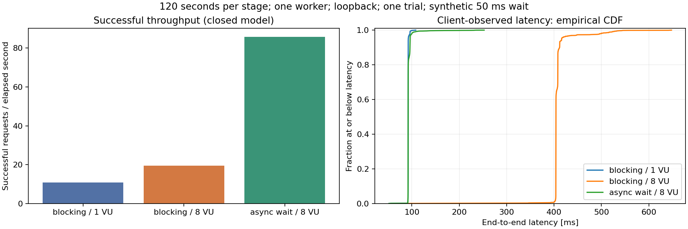

# 11-4. FastAPI 병목 맞히기

[목차](../README.md) · [정답·해설](04-bottleneck-lab-answers.md)

예상 75분. 목표: 실제 HTTP 부하 결과로 가설을 좁히고, 측정하지 않은 병목까지 주장하지 않습니다.

## 1. 먼저 예상하기

워커1개에서 `async def` 안의 `time.sleep(0.05)`와 `await asyncio.sleep(0.05)`를 비교합니다. 첫 경로는 루프를50ms 막고, 두 번째는 다른 task가 진행할 기회를 줍니다. 둘 다 실제 외부 I/O가 아닌 합성 기다림입니다. CPU계산·DB·boto3 성능을 재현하지 않습니다.

[앱](../labs/fastapi_boundaries.py)은4장의 동일 함수 경계를 사용합니다. [부하 실행기](../labs/load_http.py)는 별도 Uvicorn 프로세스의 실제 loopback HTTP/1.1을 호출하므로4장의 in-process ASGITransport 시간과 직접 비교하지 않습니다.

## 2. 환경과 절차

CPython3.12.14, FastAPI0.141.1, Starlette1.6.0, Uvicorn0.52.1, 워커1개. VUser별 지속 연결, think time0, closed 모델, 클라이언트와 서버가 같은 머신입니다. 경로별5회 warmup 후 각 단계120초, 진행 요청은 끝까지 기다립니다.

```bash
python3 study/labs/load_http.py --seconds 120   --output /tmp/load-http-new.json
```

[원본 JSON](../results/load-http-2026-10-02.json)은 모든 요청 latency표본과 집계를 보존합니다. 서버 시작 확인·warmup은 아래 요청 수에서 제외했습니다. 소켓·서버는 종료 후 정리했습니다.

## 3. 실제 관찰

| 경로 | VUser | 완료·성공 | 오류 | 성공RPS | p50(ms) | p95(ms) | p99(ms) |
| --- | --- | --- | --- | --- | --- | --- | --- |
| async 안의 blocking | 1 | 1303 | 0 | 10.85 | 92.00 | 92.38 | 96.10 |
| async 안의 blocking | 8 | 2355 | 0 | 19.56 | 404.04 | 416.12 | 522.96 |
| async I/O | 8 | 10308 | 0 | 85.85 | 92.01 | 96.17 | 106.25 |

측정 요청 **13,966개 모두 응답 내용과200상태를 검증**했습니다. RPS분모는 마지막 요청 drain을 포함한 실제 경과시간입니다. 분위수는 클라이언트 전체 경과시간의 nearest-rank입니다.

서버 프로세스 CPU는 단일 코어100% 기준 평균 약0.77%,1.50%,4.54%였습니다. 낮은 CPU에서도 블로킹 경로는 대기와 루프 직렬화로 느렸습니다. 이 지표는 서버 프로세스 user+system 시간이며 발생기·자식 전체·네트워크 비용의 완전한 합이 아닙니다.



그래프의 왼쪽은 성공 처리량, 오른쪽은 전체 클라이언트 지연의 경험적 누적분포입니다. [생성 코드](../labs/plot_load_http.py)는 저장된 JSON을 사용하며 Matplotlib 의존성은 [requirements-plots.txt](../labs/requirements-plots.txt)에 있습니다.

## 4. 해석과 반례

VUser8의 두 경로는 같은50ms 대기와 요청 형식을 사용합니다. 이번 조건에서는 루프에서 직접 막는 대기를 제거하자 처리량과 꼬리 지연이 개선되었습니다. 하지만 `async def`를 붙이는 것만으로 빠른 것은 아닙니다. 블로킹 함수가 안에 남으면 첫 경로와 같습니다.

50ms sleep인데 p50이약92ms인 값에는 HTTP전송·클라이언트·연결 동작·스케줄링 등이 포함됩니다. 이번 실험은 추가약42ms를 원인별로 분해하지 않았습니다. 특정 TCP설정 때문이라고 단정하거나 서버 처리시간으로 그대로 해석하지 않습니다.

모든 단계는 한 번씩 고정 순서로 실행했고 열린 모델·독립 발생기·운영망·DB는 없습니다. 같은 VUser는 응답에 따라 **다른 RPS를 생성**하므로 ‘고정85RPS에서 전후 비교’라고 표현하면 틀립니다. 개선의 방향을 보여 주는 실험이며 운영 용량 승인은 별도입니다.

## 5. 병목 구분 과제

| 가상 증상 | 우선 가설 | 확인 실험 |
| --- | --- | --- |
| lag높음·CPU낮음 | 루프의 동기대기 | 동기 호출 stack·offload 대조 |
| lag낮음·AnyIO40/40 | 토큰/느린SDK | 제출대기·실행시간·하류지연 |
| CPUquota포화 | 계산/직렬화 | profile·quota·worker대조 |
| DBcheckout wait높음 | 풀/긴transaction | DB실행·락·점유시간 분리 |

스레드풀·DB풀의 표는 진단 과제이며 이120초 실험에서 네 병목을 모두 주입한 결과가 아닙니다.9장의 토큰2개 실험과5장의DB실험을 조합하여 추가 실험을 설계하세요.

### Python 트랙 보강: 네 병목을 분리하는 실험 카드

| 가설 | 바꿀 한 변수 | 함께 볼 지표 | 반증 예 |
| --- | --- | --- | --- |
| 이벤트루프 | 직접 sleep→offload/async | lag·요청 지연·CPU | lag는 그대로이고 DB대기만 증가 |
| AnyIO 토큰 | 같은SDK·토큰2→4 | borrowed·제출대기·SDK시간 | DB/SDK가 더 느려져 전체 성능 악화 |
| 워커 수 | 같은총CPU에서1→2 | PID별부하·RSS·CPUquota·RPS | quota가 이미 포화여서 이익 없음 |
| DB풀 | 같은DB·풀2→4 | checkout wait·SQL·락·DBCPU | DB포화로SQL시간이 늘어남 |

9-7의 exporter는 앞의 두 가설을 관측하는 연결 예제입니다. 실제 DB풀/다중워커 가설은 해당 구성과 지표를 추가해야 하며, 모의 semaphore 대기를 DB benchmark라고 보고하지 않습니다. 요청 수·입장 대기·실제 실행·타임아웃 뒤 잔여 작업을 나눠야 합니다.

## 퀴즈

### Q1

이번 실험은 실제 S3/DB대기 성능을 측정했는가?

### Q2

같은VUser8이면 두 경로의 도착RPS도 같은가?

### Q3

낮은CPU인데 blocking 경로의 p99가 큰 이유를 설명하라.

### Q4

50ms sleep과92ms 클라이언트 지연의 차이를 특정 원인으로 확정할 수 있는가?

### Q5

관찰 결과와 미검증을 나누고 스레드풀/DB병목을 추가로 식별할 실험을 설계하라.

배점: Q1·Q2 각 1점, Q3·Q4 각 2점, Q5 4점. 8점 이상을 목표로 합니다.

## 출처와 범위

- [실행 원본](../results/load-http-2026-10-02.json), [4-2 실행 경계](../04-fastapi/02-def-async.md), [9-4 지표](../09-observability/04-bottleneck-metrics.md).
- 실제 실행일2026-10-02. 오류0은 이 표본의 관찰이며 운영 무장애 보장이 아닙니다.

확인일: 2026-10-02. 사례의 숫자는 별도 실행 결과 링크가 없으면 설명용 가정입니다.
