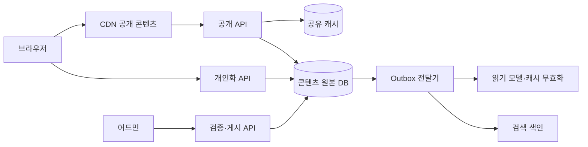

# 12-3. 저장·조회·비동기 처리 구조

[목차](../README.md) · [정답·해설](03-data-flow-answers.md)

예상 60분. 목표: 요청 경로와 갱신 경로를 분리하고 각 데이터의 원본·신선도·복구를 정의합니다.

## 1. 기본 설계안

화살표 D→O는 DB가 저절로 모든 이벤트를 발행한다는 뜻이 아니라 outbox를 읽는 전달기가 있다는 뜻입니다. 공개 캐시에 개인화 데이터를 섞지 않습니다. 검색 전체를 새로 만들지 않고 별도 제공 서비스/색인 경계로 둘 수도 있습니다.

## 2. 자료별 계약

| 데이터 | 원본 | 읽기 최적화 | 허용 지연/복구 |
| --- | --- | --- | --- |
| 편집 콘텐츠·게시 상태 | RDB transaction | 공개 캐시·CDN | 일반60초 가정, 재생성 |
| 긴급 삭제 | 원본 상태+삭제 버전 | 우선 무효화·차단 경로 | 별도 엄격 목표와 실패 확인 |
| 사용자 설정 | 사용자 DB | 사용자/테넌트 키 캐시 | 권한과 설정 신선도 구분 |
| 검색 결과 | 원본에서 파생된 색인 | 검색 엔진 | 비동기 지연, 재색인 |
| 게시 감사 | 권한 있는 변경 기록 | 조회용 별도 인덱스 가능 | 보존·변조/접근 정책 |

검색 엔진을 원본과 함께 직접 dual write하면 한쪽 실패를 처리해야 합니다. outbox를 원본 transaction과 함께 기록하고 전달·소비의 중복/역순/실패를 처리하는 방법은5-3과 같습니다.

## 3. Kafka가 필요한가

| 선택 | 맞는 압력 | 비용 |
| --- | --- | --- |
| 동기 함수/DB 갱신 | 작은 범위, 즉시 결과 | 요청 지연·장애 결합 |
| DB outbox polling | 기존 DB로 신뢰할 전달 시작 | polling 부하·정리·전달 지연 |
| 작업 큐 | 작업 분배·재시도·ack | 중복·작업 상태·운영 |
| Kafka류 로그 | 여러 소비자·재생·파티션 순서 | broker·보관·lag·schema·파티션 관리 |

Kafka를 추가하면 작업이 자동 exactly-once가 되지 않습니다. 파티션 내 순서와 전체 전역 순서도 다릅니다. ‘같은 콘텐츠의 버전 순서’에 필요한 key, 중복 이벤트 처리, 처리 불가 이벤트 격리와 replay를 설계합니다.

## 4. 논증 연습

다음은 출처의 보장을 응용한 학습용 논증이며 실제 사람의 발언이 아닙니다.

**단순안:** DB+outbox로 시작한다. 이미 운영하는 DB와 소수 소비자에 적합하다. **반박:** 검색·추천·분석 소비자가 늘면 polling과 전달 상태 관리가 복잡해진다. **재반박:** 소비자 수·지연·replay 요구가 임계치를 넘으면 로그 시스템을 도입할 전환 계획을 둔다.

**로그 중심안:** 처음부터 독립 소비자와 재생을 지원한다. **반박:** 운영 인력이 적고 트래픽도 작으면 broker가 더 큰 부담이다. **재반박:** 이미 관리형/조직 플랫폼이 있고 실제 재생 요구가 크다면 추가 비용이 작을 수 있다. 기존 인프라 유무가 선택을 바꾼다.

## 5. 적용 과제

새 게시물, 수정, 긴급 삭제가 검색·CDN에 반영되는 경로를 그리세요. 각 단계의 event_id·콘텐츠 버전·재시도·최대 지연·관측과 원본에서 다시 만드는 절차를 적습니다.

## 퀴즈

### Q1

검색 색인과 원본 DB에 차례로 쓰면 하나의 원자 transaction인가?

### Q2

Kafka 파티션 순서는 모든 이벤트의 전역 순서인가?

### Q3

공개 캐시에 개인화를 섞을 때 생길 두 비용/위험은?

### Q4

outbox와 Kafka를 선택할 때 비교할 조건 두 가지는?

### Q5

콘텐츠 게시·삭제의 원본/전달/색인/캐시 일관성과 복구를 설계하라.

배점: Q1·Q2 각 1점, Q3·Q4 각 2점, Q5 4점. 8점 이상을 목표로 합니다.

## 출처와 범위

- [5-3 읽기 모델](../05-database/03-read-models.md)의 outbox 근거·한계를 적용했습니다.
- [Kafka design](https://kafka.apache.org/documentation/#design)은 파티션·전달 의미를 확인할 추가 읽기이며 이 설계에서 Kafka를 설치하지 않았습니다.

확인일: 2026-10-02. 사례의 숫자는 별도 실행 결과 링크가 없으면 설명용 가정입니다.
